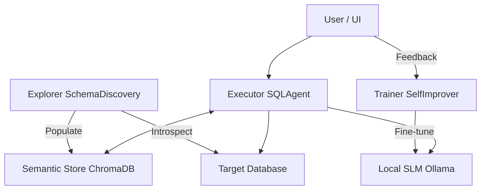

# ⚡ EvoSQL-Lightning

**EvoSQL-Lightning** is a robust, modular Natural Language to SQL (NL2SQL) system.

## 🚀 Key Features

- **Hybrid Cloud Architecture**:
  - **UI**: Runs on Streamlit Cloud (accessible from anywhere).
  - **Brain**: Runs on **YOUR** hardware (Local Ollama) via a secure tunnel, or uses OpenAI.
- **SLM-First**: Optimized for **Llama 3**, **Mistral**, **Phi-3**.
- **Robust Intelligence**:
  - **Auto-Explanation**: Catches silent errors by explaining logic in plain English.
  - **Safe Execution**: Sandboxed environment prevents destructive queries (`DROP`, `DELETE`).
  - **Auto-Auditor**: AI Critic automatically audits queries and labels data.
- **Self-Improving Loop**: Collects feedback to build a fine-tuning dataset (even from the cloud).

## 🛠️ Deployment (Streamlit Cloud)

This app is "Cloud Ready". You can deploy it for free on Streamlit Community Cloud.

### 1. Push to GitHub

Fork this repository and push it to your GitHub account.

### 2. Deploy

1. Go to [share.streamlit.io](https://share.streamlit.io).
2. Select this repository and the file `src/components/ui.py`.
3. Click **Deploy**.

### 3. Configure Intelligence (Secrets)

The app needs a "Brain". You have two options:

#### Option A: Free & Private (Local Ollama) 🏠

Use your own GPU/CPU to power the cloud app.

1. Run Ollama locally: `ollama run llama3:8b`
2. Expose it via Ngrok: `ngrok http 11434`
3. In Streamlit Cloud Settings > **Secrets**:
   ```toml
   OLLAMA_BASE_URL = "https://your-ngrok-url.ngrok-free.app"
   ```

#### Option B: Convenience (OpenAI) ☁️

Use GPT-4o or GPT-3.5.

1. In Streamlit Cloud Settings > **Secrets**:
   ```toml
   OPENAI_API_KEY = "sk-..."
   ```

## 🏗️ Architecture (Hybrid)



## 🏃‍♂️ Local Usage

You can still run it entirely locally:

```bash
# Setup
pip install -r requirements.txt

# Run
./.venv/bin/python -m streamlit run src/components/ui.py
```

## 📈 Self-Improvement

The system collects "Gold Standard" examples based on your feedback.

- **On Cloud**: Data helps you verify logic, but files are ephemeral (reset on reboot).
- **On Local**: Data is saved to `training_data.jsonl`, which you can use to **Fine-Tune** your local Llama 3 model using generic tools like **Unsloth** or **MLX**.
