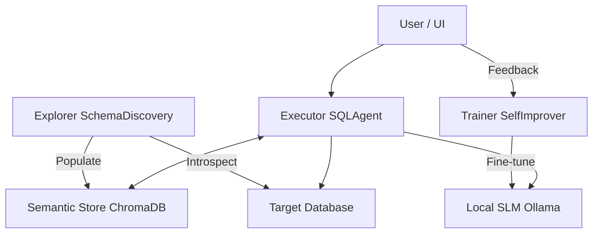

# ⚡ EvoSQL-Lightning

**EvoSQL-Lightning** is a modular, high-performance system that turns **Natural Language into SQL** (NL2SQL). Designed for the **Hybrid Cloud**, it combines the accessibility of a Cloud UI with the privacy and power of **Local LLMs** (like Llama 3) running on your own hardware.

It is not just a translator; it is an **Agentic System** that audits, explains, and improves itself.

## 🚀 Key Features

### 🛡️ Secure by Design

- **Safety Sandbox:** Never worry about an accidental `DROP TABLE` or `DELETE FROM users`. The executor identifies and blocks destructive queries before they touch your database.
- **Privacy First:** Your data schema and queries stay on your machine (when using Local Ollama).

### 🧠 Robust Intelligence

- **Auto-Explanation:** The model doesn't just run code; it explains _why_. It translates the generated SQL back into plain English (e.g., _"I am calculating the average revenue per user filtered by active status"_), helping you catch silent logic errors.
- **Auto-Auditor (AI Critic):** A secondary "Judge" model reviews every interaction. It scores the SQL quality and flags hallucinations, creating a reliable feedback loop.

### 🔄 Self-Improving System

- **Active Learning:** Every "Thumbs Up" 👍 you give isn't just a metric; it's saved to a **Golden Dataset**.
- **Fine-Tuning Loop:** Use this dataset to fine-tune your local SLM (e.g., using Unsloth/MLX), making the model smarter about _your_ specific schema over time.

### ☁️ Cloud Ready, Locally Powered

- **Hybrid Architecture:** Deploy the beautiful Streamlit UI to the cloud for free.
- **Infinite Inference:** Connect it via **Ngrok** to your local GPU. Zero API costs, infinite tokens, and full data control.

## 🛠️ Deployment (Streamlit Cloud)

This app is "Cloud Ready". You can deploy it for free on Streamlit Community Cloud.

### 1. Push to GitHub

Fork this repository and push it to your GitHub account.

### 2. Deploy

1. Go to [share.streamlit.io](https://share.streamlit.io).
2. Select this repository and the file `src/components/ui.py`.
3. Click **Deploy**.

### 3. Configure Intelligence (Secrets)

The app needs a "Brain". You have two options:

#### Option A: Free & Private (Local Ollama) 🏠

Use your own GPU/CPU to power the cloud app.

1. Run Ollama locally: `ollama run llama3:8b`
2. Expose it via Ngrok: `ngrok http 11434`
3. In Streamlit Cloud Settings > **Secrets**:
   ```toml
   OLLAMA_BASE_URL = "https://your-ngrok-url.ngrok-free.app"
   ```

#### Option B: Convenience (OpenAI) ☁️

Use GPT-4o or GPT-3.5.

1. In Streamlit Cloud Settings > **Secrets**:
   ```toml
   OPENAI_API_KEY = "sk-..."
   ```

## 🏗️ Architecture (Hybrid)



## 🏃‍♂️ Local Usage

You can still run it entirely locally:

```bash
# Setup
pip install -r requirements.txt

# Run
./.venv/bin/python -m streamlit run src/components/ui.py
```

## 📈 Self-Improvement

The system collects "Gold Standard" examples based on your feedback.

- **On Cloud**: Data helps you verify logic, but files are ephemeral (reset on reboot).
- **On Local**: Data is saved to `training_data.jsonl`, which you can use to **Fine-Tune** your local Llama 3 model using generic tools like **Unsloth** or **MLX**.
